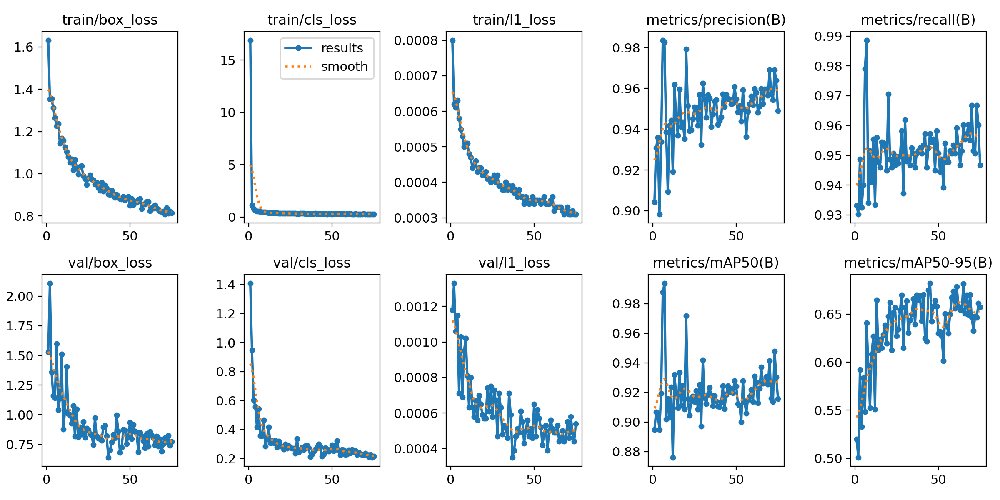
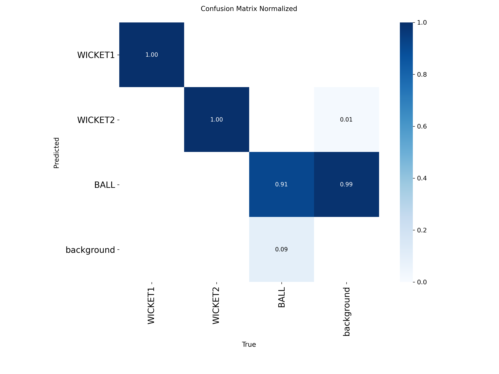

# Cricket Ball Speed Tracker

A computer vision pipeline that detects a cricket ball and wickets in match footage, tracks the ball's trajectory through each delivery, and estimates real-world release speed (km/h) — fully automatically, from raw video to an annotated output.

Built as a two-stage project: a **training notebook** (fine-tunes a YOLO detector on hand-labeled frames) and an **inference notebook** (calibration, tracking, delivery segmentation, and speed calculation).

---

## What it does

1. **Detects** the ball and both sets of wickets in every frame using a fine-tuned YOLO model.
2. **Calibrates** pixel-to-meter scale using the known real-world distance between the wickets (20.12 m pitch length).
3. **Tracks** the ball's position frame-by-frame with a Kalman filter, smoothing out missed detections and jitter.
4. **Automatically segments** the full video into individual deliveries — no manual trimming required.
5. **Truncates** each delivery window at the point the ball reaches the batsman, so post-contact motion (bat hits, deflections) doesn't distort the speed calculation.
6. **Calculates** peak and average speed per delivery and renders it all back onto the video as an annotated output.

---

## Pipeline overview

```
Raw video
   │
   ▼
YOLO detection (ball + both wickets, every frame)
   │
   ▼
Pixel → meter calibration (wicket-to-wicket known distance)
   │
   ▼
Kalman filter tracking (per-frame ball position, gap-tolerant)
   │
   ▼
Automatic delivery segmentation (ball-presence gaps + duration-based merge splitting)
   │
   ▼
Truncate at batsman's wicket (release/flight speed only, excludes post-hit motion)
   │
   ▼
Speed calculation (km/h) + annotated output video
```

## Model performance

Trained a YOLO detector (fine-tuned from COCO-pretrained weights) on hand-labeled frames from match footage — 3 classes: `WICKET1`, `WICKET2`, `BALL`. 75 epochs (early-stopped, `patience=30`), chronological 80/20 train/val split (single source video, so no video-level split was available).

**Best checkpoint (epoch 45):**

| Metric | Value |
|---|---|
| Precision | 95.5% |
| Recall | 95.7% |
| mAP@50 | 92.4% |
| mAP@50-95 | 68.2% |

**Per-class AP@0.5 (final validation pass):**

| Class | AP@0.5 | Notes |
|---|---|---|
| WICKET1 | 0.995 | Static object, consistently detected |
| WICKET2 | 0.995 | Static object, consistently detected |
| BALL | 0.785 | Small, fast-moving — the harder detection target |

The gap between wicket and ball detection quality is expected and is exactly why the downstream pipeline exists: the Kalman filter, gap-tolerant tracking, and automatic segmentation all compensate for the ball not being detected in every single frame (~55% of all frames in the full video have a ball detection; within an active delivery window this rises to ~90%+).

Training/validation loss curves, precision-recall curves, and confusion matrices are in [`training_results/`](./training_results).

<p align="center">
  
</p>

<p align="center">
  
</p>

---

## Repository structure

```
cricket-ball-speed-tracker/
├── README.md
├── requirements.txt
├── models/
│   └── ball_detector_best.pt  # trained YOLO checkpoint (~19MB)
├── notebooks/
│   ├── training.ipynb       # dataset assembly, training, validation
│   └── inference.ipynb      # calibration, tracking, segmentation, speed calc
├── training_results/        # results.csv, results.png, PR/F1 curves, confusion matrices
├── outputs/
│   └── output.mp4           # annotated output video with delivery number + speed overlay
└── .gitignore
```

---

## Results

Tested on a **data-collection video** (~2 minutes, 3,804 frames, 21 deliveries automatically detected and measured) — not match footage. This clip was recorded specifically to gather training/testing data, with the bowler deliberately throwing at slow, controlled pace for ease of capture. The resulting speeds (roughly 40-55 km/h average) reflect that deliberately slow, controlled throwing style, **not** the pipeline's accuracy ceiling — the same pipeline would report proportionally higher speeds on genuine fast-bowling footage, since the detection → calibration → tracking → speed math has no dependency on how fast the ball is actually moving.

Sample of per-delivery output (from the full run of 21 automatically detected deliveries):

| Delivery | Peak Speed (km/h) | Avg Speed (km/h) |
|---|---|---|
| 1 | 57.6 | 41.8 |
| 5 | 59.1 | 49.0 |
| 12 | 65.0 | 55.5 |
| 21 | 59.6 | 37.5 |

The full annotated video with all 21 deliveries, live speed, and per-delivery peak/average overlay is in [`outputs/output.mp4`](./outputs/output.mp4).

---

## Setup

```bash
pip install -r requirements.txt
```

**Requirements:** `ultralytics`, `opencv-python-headless`, `filterpy`, `numpy`, `pandas`, `matplotlib`

The trained detector weights are included at [`models/ball_detector_best.pt`](./models/ball_detector_best.pt) — no retraining needed to run inference.

Both notebooks were developed and run on Kaggle (GPU-accelerated). Paths in `MODEL_PATH` / `VIDEO_PATH` / `DATA_YAML_PATH` will need updating if run outside that environment.

---

## Limitations & possible extensions

- Calibration assumes a side-on camera view where the ball's flight stays in a roughly constant depth plane relative to the camera; a significantly angled or elevated camera would need proper perspective correction (homography) rather than a single linear pixel-to-meter scale.
- BALL detection (AP@0.5 = 0.785) is the main accuracy bottleneck; more labeled ball examples, especially at motion blur / high-speed frames, would likely improve it most.

---

## Acknowledgments

This project was independently designed and built by me as part of my internship at **CAID**, who provided supervision and guidance throughout. All code, design decisions, and implementation are my own work.

It combines object detection (YOLO), object tracking (Kalman filtering), and applied geometry/physics (pixel-to-real-world speed calibration) into one end-to-end pipeline.
